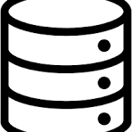

# kpi-task-tracker
This is a KPI Task Management Tracker

# 📈 KPI & Task Tracker v1

This is a lightweight web-based KPI and Task Management System built with PHP, MySQL, and Chart.js. Designed as a real-world MVP (Minimum Viable Product) to showcase CRUD operations, simple analytics, and database interaction.

---

## 🔧 Features

- ✅ Task Management (CRUD)
- ✅ KPI Management (CRUD)
- ✅ User assignment to tasks and KPIs
- 📊 KPI Dashboard with visual charts (Chart.js)
- 📁 Modular includes for header/footer
- 🗂 Organized PHP file structure

🧪 Version 1 Tech Stack
- Frontend: HTML, Bootstrap 5, Chart.js
-(image.png)Backend: PHP (Modular pages with includes)
- Database: MySQL with PDO
- Architecture: Procedural PHP with MVC-style separation

🎯 Future Enhancements
✅ User authentication & login
🔔 Email reminders for KPIs and Tasks
📅 Deadline calendar view
📤 Export to Excel/PDF
🧩 Role-based access control
📈 Advanced analytics by department/user

---

## 📁 Folder Structure


## ⚙️ Prerequisites

- PHP 7.4 or later
- MySQL/MariaDB
- Apache (XAMPP, WAMP, or similar)
- A web browser

---

## 🚀 Getting Started

1. **Clone the Repository**
   ```bash
   git clone https://github.com/yourusername/kpi-task-tracker.git
   cd kpi-task-tracker
